# Get started with Real-Time Analytics and Data Science with Microsoft Fabric

### Overall Estimated Duration: 4 Hours

## Overview

In this lab, we will use Microsoft Fabric to perform real-time data analytics and data science. Fabric provides an end-to-end platform for data solutions, including Synapse Real-Time Analytics, which leverages a KQL Database and Kusto Query Language (KQL) to analyze structured and unstructured data efficiently. Real-time analytics enables organizations to process log files, streaming data, and time-series information at scale. Additionally, data science techniques, including machine learning with scikit-learn in Python, help identify complex patterns and train AI models. This integration empowers organizations to extract meaningful insights and democratize data access for informed decision-making.

## Objective

- **Real-Time Analytics in Microsoft Fabric:** Learn how to use Real-Time Analytics in Microsoft Fabric, focusing on Synapse Real-Time Analytics with Kusto Query Language (KQL) for data analysis. By the end of this session, you will know how to analyze real-time data using KQL and add KQL queries to Power BI reports to get useful insights easily.
- **Data science in Microsoft Fabric:** Learn the basics of data science in Microsoft Fabric, covering important concepts and real-world uses. By the end of this session, you will be able to analyze data, create AI models, and manage machine learning workflows effectively.

## Prerequisites

- Basic understanding of cloud computing and data analytics concepts.  
- Familiarity with Microsoft Azure services.  
- A Microsoft Fabric-enabled workspace with necessary permissions.  
- Access to Microsoft Fabric services such as OneLake, Data Engineering, and Data Science experiences.  
- Familiarity with Power BI reports.

## Architecture

These labs follow a structured, step-by-step workflow to streamline data processing and machine learning operations. The process begins with authentication and access management, ensuring secure entry into the environment. Next, a workspace is established, where users interact with datasets, perform queries using KQL, and generate insightful reports. Data is then uploaded into the system, stored efficiently, and prepared for further processing. Once the data is available, it is loaded into notebooks for analysis, followed by the training of machine learning models to extract meaningful insights. To enhance the experimentation process, MLflow is utilized to track and manage various model iterations, ensuring optimal performance. Finally, the trained models and notebooks are systematically saved, and the computational session is terminated to optimize resource utilization. This structured approach ensures a seamless transition from data ingestion to model training and experiment tracking while maintaining efficiency and reproducibility throughout the process.

## Architecture Diagram

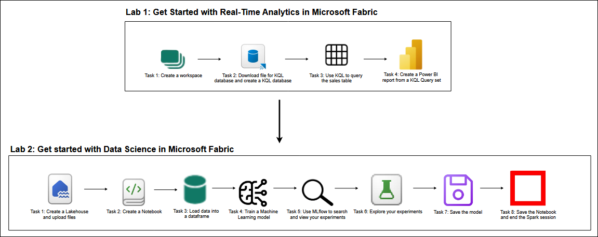

## Explanation of Components

The architecture for this lab involves several key components:

- **Workspace:** A centralized environment for managing resources, projects, and collaboration.
- **KQL Database:** A structured database supporting Kusto Query Language (KQL) for analyzing large datasets efficiently.
- **KQL Querysets:** Predefined queries using KQL to extract, manipulate, and visualize data.
- **PBI:** Power BI-generated reports for data visualization and insights.
- **Lakehouse:** A unified storage solution combining data lakes and warehouses for scalable analytics.
- **Notebook:** An interactive document for writing, executing, and visualizing code, commonly used in data science and engineering.

## Getting Started with the Lab

Welcome to Real-Time Analytics and Data Science with Microsoft Fabric Workshop! We've prepared a seamless environment for you to explore and learn about fabric services. Let's begin by making the most of this experience.

## Accessing Your Lab Environment

Once you're ready to dive in, your virtual machine and lab guide will be right at your fingertips within your web browser.
 

 
## Exploring Your Lab Resources
 
To get a better understanding of your lab resources and credentials, navigate to the **Environment Details** tab.
 
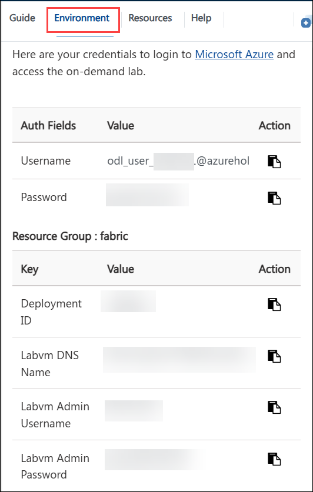
 
## Utilizing the Split Window Feature
 
For convenience, you can open the lab guide in a separate window by selecting the **Split Window** button from the top right corner.
 

 
## Managing Your Virtual Machine
 
Feel free to start, stop, or restart your virtual machine as needed from the **Resources** tab. Your experience is in your hands!
 
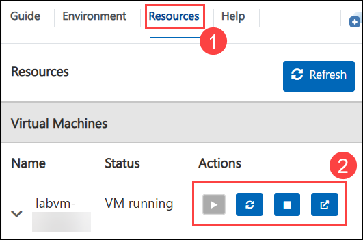
 
## Lab Guide Zoom In/Zoom Out
 
To adjust the zoom level for the environment page, click the **A↕ : 100%** icon located next to the timer in the lab environment.

  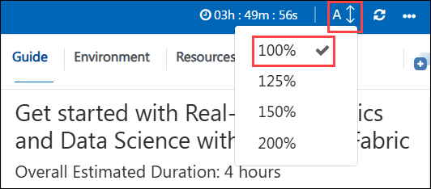

## Let's Get Started with Fabric Portal

1. On your virtual machine, click on the **Microsoft Edge** icon as shown below:
 
   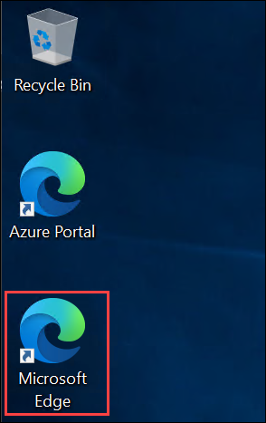

1. In the new tab, navigate to the **Microsoft Fabric** portal by copying and pasting the following URL into the address bar.

   ```
   https://app.fabric.microsoft.com
   ```
   
1. On the **Enter your email, we’ll check if you need to create a new account.** tab, you will see the login screen. In that enter the following email/username **(1)** and click **Submit (2):**

   - **Email/Username:** <inject key="AzureAdUserEmail"></inject>
 
       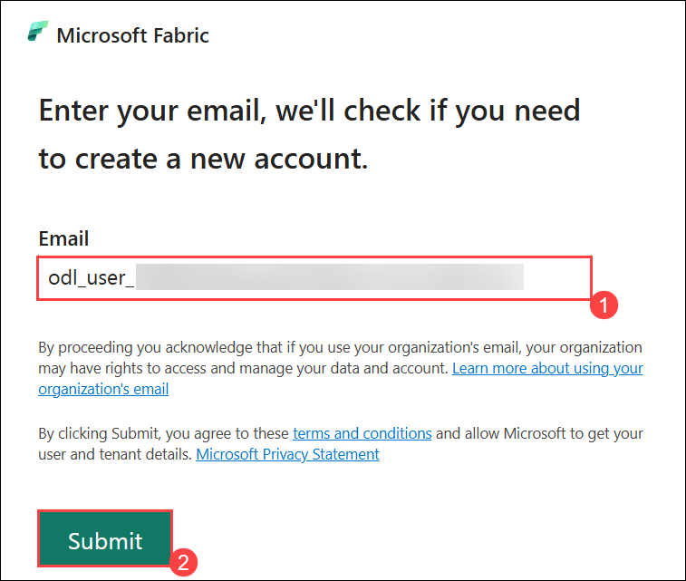
 
1. Next, provide your password **(1)** and click on **Sign in (2)**
 
   - **Password:** <inject key="AzureAdUserPassword"></inject>
 
       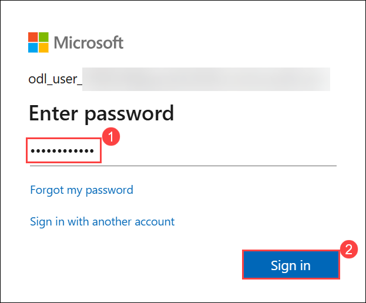

1. If you see the pop-up **Stay Signed in?**, select **No**.

   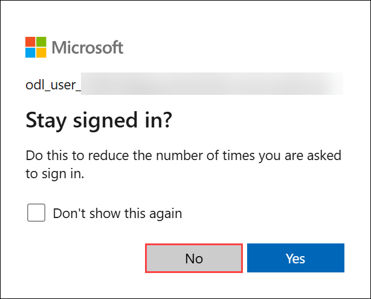

1. When the **Welcome to the Fabric view** dialog appears, click **Cancel**.

   

1. A new pop-up will appear with the message **Microsoft Fabric (Free) license assigned**. Click on **OK**.

   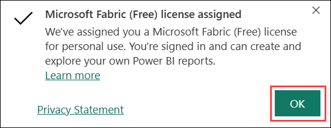

1. After signing in, you’ll be directed to the **Fabric** Home page. click on the **Account manager** icon at the top-right corner **(1)** of the portal. In the profile pane that appears, click on **Free trial** **(2)** to begin activating your Microsoft Fabric trial.

   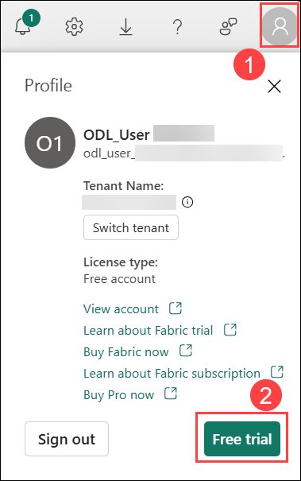

1. On the **Activate your 60-day free Fabric trial capacity** page, click **Activate** to start your trial.

   

   >**Note:** The trial capacity region may differ from the one shown in the screenshot. No need to worry – simply use the default selected region, activate it, and continue to the next step.

1. If you see a pop-up message saying **Successfully upgraded to Microsoft Fabric**, click **Got it**.

   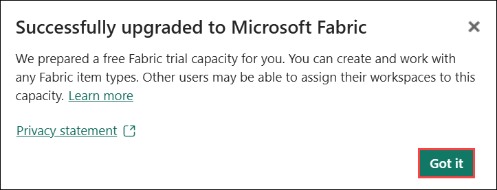
   
## Support Contact
The CloudLabs support team is available 24/7, 365 days a year, via email and live chat to ensure seamless assistance at any time. We offer dedicated support channels tailored specifically for both learners and instructors, ensuring that all your needs are promptly and efficiently addressed.
 
Learner Support Contacts:
 
- Email Support: cloudlabs-support@spektrasystems.com
- Live Chat Support: https://cloudlabs.ai/labs-support

Now you're all set to explore the powerful world of technology. Feel free to reach out if you have any questions along the way. Enjoy your workshop!

Now, click on **Next** from the lower right corner to move on to the next page.

  
 
### Happy learning!
